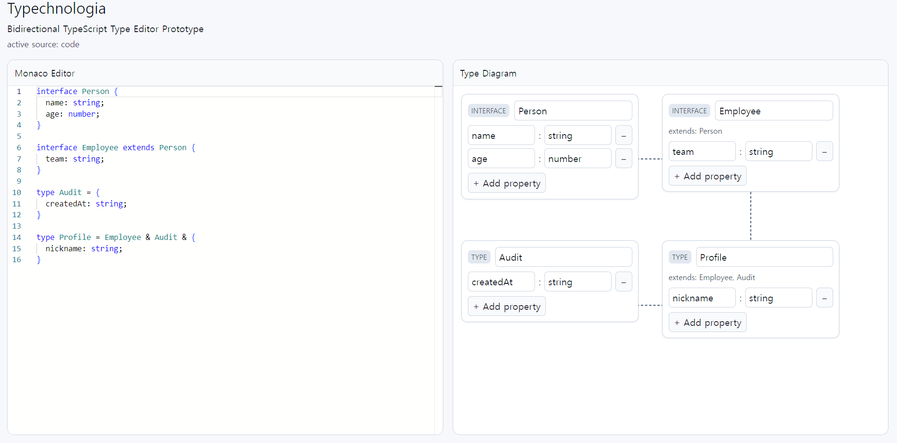

# Typechnologia

### TypeScript 타입 & 인터페이스 비주얼 매니저



```
[Monaco Editor]  ←→  [타입 시각화 컴포넌트]
  타입 코드 입력         컴포넌트 클릭/수정
      ↓                      ↓
  @typescript/vfs        타입 내용 변경
      ↓                      ↓
  AST 파싱 →→→→→→→→→→→→   코드 재생성
  ```

> 양방향 무한 업데이트 루프 대비  
- source 플래그로 어느 쪽이 트리거했는지 추적

### 구성
- 앱 상태/동기화: `App.tsx`
- 파싱/직렬화(@typescript/vfs + TypeScript AST): `typeSync.ts`
- 타입 모델: `model.ts`
- 코드 패널: `CodePanel.tsx`
- 다이어그램/엣지: `DiagramPanel.tsx`
- 노드 카드 편집(UI): `TypeNodeCard.tsx`
- 레이아웃/스타일: `App.css`, `index.css`

### 추가예정
- [] 캔버스 렌더링
- [] 에디터 collapse
- [] 다이어그램 패널 구체화
- - Declaration/Property별 UI 구상
- [] localStorage ㄱㄱ